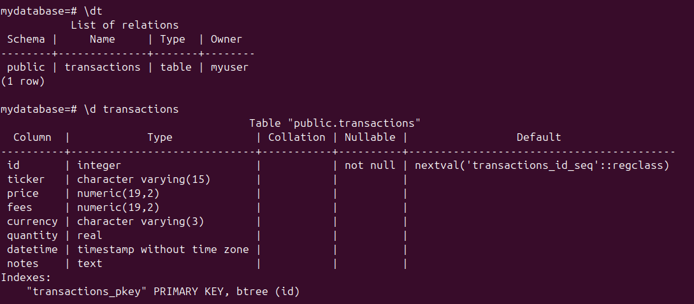

## Connecting to PostgreSQL Container with Python

Last time, I stood up a Postgres database container with data stored in a docker volume. The next thing to do is to connect from my Python program to that Postgres database, so that I can perform all the usual CRUD work from the program. One approach I have taken in the past is to take raw SQL strings, either generated by Python code or loaded (possibly with placeholders for variables) from a file, start a subprocess with something like SQLCMD, and execute the SQL against the database in question. This has the advantage of full SQL control, which I like, with the downside of having to explicitly start a new process each time you want to interact with the database. This can be improved using something like `pyodbc`, which to my mind is essentially a Pythonic implementation of of SQLCMD, since it's a wrapper around ODBC. There's the option of SQLAlchemy, which I understand is pretty popular in the Python community, but which I've never particularly loved on the few times I've interacted with it. Forcing a class-based view of interacting with a database, which is my memory of it (could be wrong, it's been a while and I didn't use it much) was not to my liking; I spent time learning how to use SQL to a moderate degree and so I don't feel the need to hide that behind Python, necessarily.  

When watching everyone's favourite Netflix-turned-streamer engineer, I heard mention of something called 'Drizzle', which appeared to be a library for Typescript that was a fully-featured ORM, but which Primeagen commented he used mostly as a 'SQL builder'. Intrigued, I ran the old Drizzle-ORM-but-for-Python search, and came across a new library called Embar. It promises type safety (which is a nice-to-have), async support, a full-featured ORM if you want it, a SQL-esque query builder, and the N+1 problem 'prevented by design'. I'm no ORM-connoisseur, but this is apparently a relatively common performance issue with ORMs. It relies on Python 3.14 and it's not yet stable enough to rely on for production, but neither of those is an issue for what I'm doing here, so I'm willing to give it a try: if anything, it may be beneficial as it's another push towards correct encapsulation in case I need to switch out the database connection logic at a later date to something like SQLAlchemy, SQLModel, or even pyodbc.  

I started with writing some context managers to handle database connection setup and teardown. These are pretty simple at the moment with no error handling, but it will make it easier to alter in the future without (hopefully) altering the interface for other sections of the program. This is especially important given the pre-alpha ORM I'm using. There's not even any exception handling just yet.  

Having done this, the next thing to try (obviously) is to test it. I thought - "Oh, no worries, I'll just run a simple 'SELECT 1' to confirm that I am actually reaching the database as I expect." I spent some time looking through the documentation, and found what I was looking for. I wrote the Python, ran the code, and...nothing? Or, not quite nothing. When I printed the result of the query, it displayed a representation of a DbSql object. Ok, sounds reasonable - but while digging through the file where this class was defined, I found another class called ReturningDbSql, along with some comments explaining that DbSql executed code on the server but didn't return the result, whilst the ReturningDbSql did.  

So, it appears that the connection to the database itself is working, but I struggled to execute the query. I eventually realised I'd somewhat confused the patterns for async and not-async database queries, and that all I needed to do was execute .run() on the query object, but for now I decided to park this and come back to it. Instead, I decided to explore creating a model, which is a class that subclasses from the Embar Table class. It looks quite like a dataclass: just a series of class attributes that will be converted into the columns in the table, with the ability to control some of the details about the columns (non-nullable, primary key, that sort of thing). So, the most important question is, quite obviously: how long can a stock ticker be? I don't want to over-allocate space here...  
- creating transaction model: how long is the longest ticker? appears nasdaq/nyse have been upgraded to handle 8 character tickers. let me do 15 and never have to think about it again
- why we shouldn't use MONEY for money lol
- currency codes must be 3 characters: feels risky to only allow three, but there's a standard, let's tie ourselves to it
- oh, actually all models need to be in one file, I think
- create a ddl dump with embar schema 
- what do I do with that dump?
- I see that sqlmodel works with alembic as it's based on sqlalchemy. 
- decide to go with atlas to experiment
- appears to be a tool to work out migration diffs and apply them
- experimented with docker compose, but I think it's unnecessary at this stage
- eventually gave up and installed atlas onto my machine. Struggling with understanding mounting the necessary files for a containerised workflow. Will come back to this
- "good migrations" by the Beach Boys 
- hmmm, some of those should be not null, let's sort that with another migration!
- hey, that was easy now that I have a bunch of make commands for it! good stuff
- writing a helper script to load some existing transactions into the model
- fails to load to database
- got it loading database, but cannot for the life of me figure out how to insert a batch of records with the primary key auto generating via serial. Seems to both require a value as there's no default in the model, but then you lose the value of the serial auto-incrementing. Maybe worth a PR?
- Going to switch to SQLModel for now, saving off this work, so I can always come back to it
- Immediately up and running quicker. Run over the various files, how it breaks down, what changes i made, how to create migrations, what that generates, and then applying it
- Very quickly up and running with a basic fast api web app, and within 5 minutes am returning data from the database. What a winner
